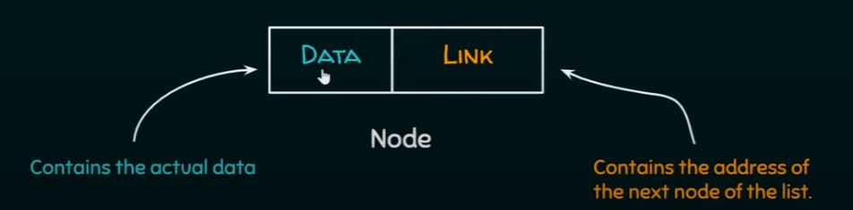
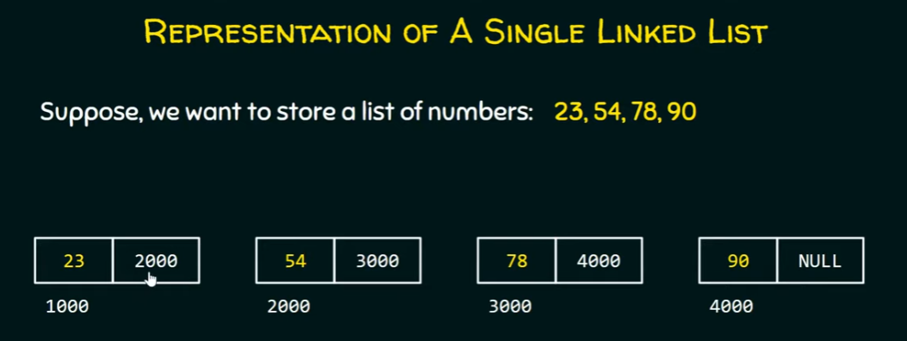
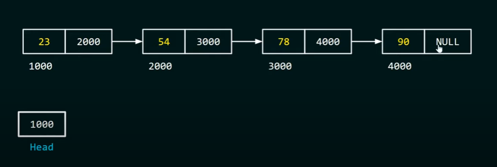

# Linked list

## definition:
A linked list is a data structure consisting of a sequence of elements where each element points to the next element in the sequence. Unlike arrays, linked lists do not have a fixed size and can grow or shrink dynamically.
There are three types of linked lists:
- `single linked list`: Navigation in forward only
- `doubly linked list`: forward and backward navigation is possible
- `circular linked list`: last element is linked to the first element

In C, we typically implement a linked list using structures. Each element of the linked list is represented by a structure called a node. Each node contains two parts:
- Data: The actual data being stored.
- link/Pointer: A reference to the next node in the sequence.

### Single linked list representation

nodes are scattered here and there in the memory but they are still connected with wach other.
from here, we can say linked list is the linked representation of list.

### Question: how can we point to the first Node
 =>response: by the head  
the first element named `head`
last element named `tail`


---

### self referential structure 
self referential structure is a structure which contains a pointer to a structure of the same type

```C
struct abc{
    int a;
    int b;
    struct abc *self;
};
```

we will use self referential structure for creating a Node of the single linked list.

### Node representation
```C
struct node{
    int data;
    struct node *link;
};
```

### In General
```C
struct node{
    data_type data1;
    data_type data2;
    data_type data3; 
          
        ...         // we can use a lot id data
                        
    struct node *link;  // just one pointer
};
```
### creating Node in C

```C
#include <stdio.h>    // for standard input/output
#include <stdlib.h>   // to calling malloc function

struct node{
    int data;
    struct node *link;
};

int main(){}
```
---
### traversing a single linked
traversing a single linked list means visiting each node of a single linked list until the end node is reached.


